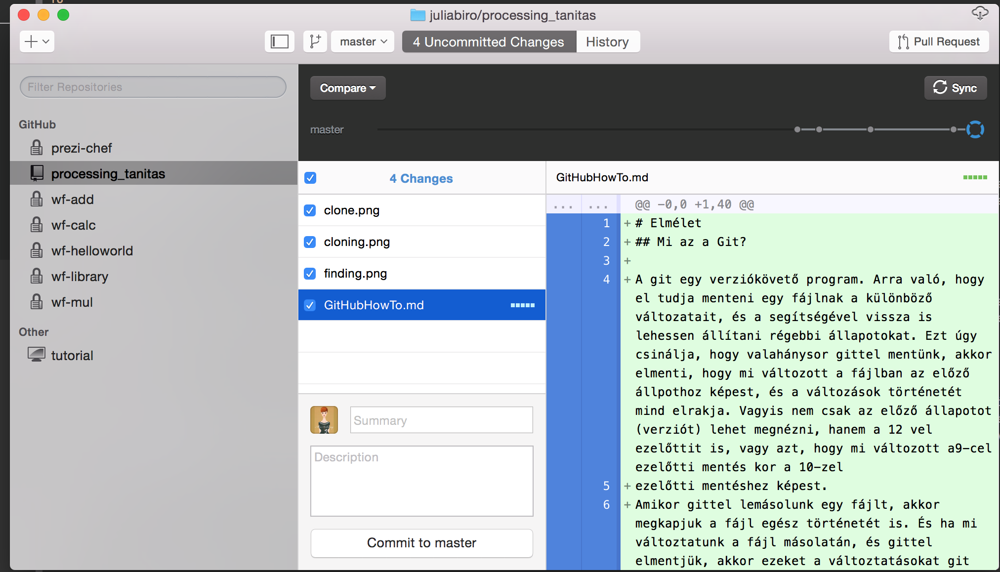

# Elmélet
## Mi az a Git? 

A git egy verziókövető program. Arra való, hogy el tudja menteni egy fájlnak a különböző változatait, és a segítségével vissza is lehessen állítani régebbi állapotokat. Ezt úgy csinálja, hogy valahánysor gittel mentünk, akkor elmenti, hogy mi változott a fájlban az előző állpothoz képest, és a változások történetét mind elrakja. Vagyis nem csak az előző állapotot (verziót) lehet megnézni, hanem a 12 vel ezelőttit is, vagy azt, hogy mi változott a9-cel ezelőtti mentés kor a 10-zel
ezelőtti mentéshez képest. 
Amikor gittel lemásolunk egy fájlt, akkor megkapjuk a fájl egész történetét is. És ha mi változtatunk a fájl másolatán, és gittel elmentjük, akkor ezeket a változtatásokat git segítségével könnyű megismételni a fájl eredetijén. Ezért aztán arra sozkták hasnzálni, hogy többen párhuzamosan dolgozzanak egy fájl másolatain, és a változásokat a git összefésüli a közös eredeti fáljban. Mi ezt úgy hasnzáljuk ki, hogy hol a suliból, hol otthonról dolgozunk ugyanazokon a fájlokon.

## 1. Repositoryk

Egy repository az egy olyan tárolódoboz, amin belül a git követi a fájlok történetét. Egy repositoryban sok fájl és mappa lehet, és velük együtt rejtett fájlokban elmentve ott van az egész történetük. Egy repository tartalma az egy mappában van, és van ott egy rejtett .git nevű mappa amiben a git tartja a történetet meg a saját kis dolgait, ezzel nem kell foglalkoznunk. 
A repository általában egy logikailag összefüggő munka, pl egy program kódja, vagy egy weboldalé, vagy pl egy szakdolgozat. A repository rövid neve repó.

## Klónozás

Amikor lemásolunk egy repositoryt (a saját gépünkre), azt úgy hívják, hogy klónozás. Ilyenkor a repository egész tartalmát és egész történetét megkapjuk, és létrejön egy ugyanolyan repository, mint az eredeti, szintén egy saját mappában. Ha egy másolatban csinálunk egy változtatást és elmentjük, akkor ezt a változtatást az eredetiben is meg lehet ismételni, és akkor megint két teljesen egyforma mappánk lesz, teljesen egyforma történettel. 
A repositorykat általában úgy csinálják meg, hogy bárki lemásolhassa őket, de nem mindenkinek van joga beleírni. Ezért a gittel könnyen lehet kódot megosztani: csak odaadod a másiknak a repository elérhetőségét, hogy másolja le onnan. 

## Commitolás

Ez a mentés. Ilyenkor a git megnézi, hogy milyen változás történt a fájl előzőleg mentett változatához képest, és ezt elmenti. Minden commithoz tartozik egy szöveges üzenet, ami azt hivatott leírni, hogy mi változotott és miért. Amikor sokan egyszerre dolgoznak egy repositoryn, akkor ezekből a üzenetekből összeáll a repository közös történte. 

## Push, Pull, Sync

Ha két repository egymás másolata, vagy közös eredetiből lettek lemásolva, akkor az egyikben lévő commitokat le lehet másolni a másik repositoryba. Ilyenkor ott is végrehajtódnak a változások, és a történethez is hozzáadódnak. A push, a pull, és a sync egy ilyen változásmásolás, az elnevezések azt jelzik, hogy ki kezdeményezi a dolgot. Ha le akarom másolni egy másik repóból az őj változásokat, akkor "behúzom" őket, az a pull. Ha a sjaát változásaimat akarom a másik repóba átmásolni, akkor "odatolom" őket, ez a push. A sync az meg ha mindkettő megtörténik. 

# Ennyi?

Nem, egyáltalán nem ennyi, a git még sokkal de sokkal többmindent tud, ez egy igen profi eszköz, amivel sokezer tud együtt dolgozni hatékonyan. De nekünk nincs mindenre szükségünk. 

# Gyakorlat

A github.com-on létrehoztunk egy repository-t (van aki többet is, de nekünk csak egyre van szükségünk), ennek a neve processing. A lilamacskás github programmal lemásoltuk az iskolai gépekre és az otthoni gépeitekre is. Ez azt jelenti, hogy van a gépen egy mappa, aminek az a neve hogy processing, és aminek a tartalmát lehet szinkronizálni a github.comon lévő tartalommal. 

## Klónozás

Nyisd ki a github programot, és jelentkezz be (beállítások, accounts). Baloldalt felül van egy kis plusz jell, azt megnyomva válaszd ki a clone opciót. Ha be vagy jelentkezve, akkor fel fogja ajánlani, hogy azok közül a repository-k közül klónozz egyet, amiket te hoztál létre a githubon . Válaszd ki a processing nevűt (ez enyémet processing_tanítas-nak hívják). Itt tudod beállítani azt is, hogy hova másolja a github a repót. Olyan helyet válassz, amit meg fogsz találni később. Ha leokézod, akkor el fogja kezdeni másolni
. De ha nem találod, akkor a girhub programotól mindig megkérdezheted, hogy hova tette. A lilamacskás program baloldali sávjában vannak azok a repositoryk listázva, amiket én a gépre lemásoltam. 

## Commitolás

Elkezdek dolgozni a processing mappámban. Én például most írom ezt a leírást. A git érzékeli, hogy a fájlok megváltoztak, vagy ha új fájlok jelentek meg, és kilistázza a lilamacskás program középső oszlopában, hogy melyik fájlok változtak meg a legutóbbi mentés óta, a bal oldalon pedig azt, hogy mi volt pontosan a változás. Pl én írtam egy csomó szöveget és beletettem 3 képet is. 
Ha most a summary mezőbe beleírok egy kis üzenetet, és megnyomom a commit gombot, akkor a git elmenti a változtatásaimat egy új commitba. Ekkor a középső oszlop kiürül, hiszen most nincsen különbség a fájlok és a legutolsó mentett verzió óta (hiszen csak 2 perce mentettem). . Ezt ki is írja a baloldali oszlopba, és a középső oszlop aljára pedig azt, hogy mi volt az utolsó commit és mi volt a hozzá tartozó kis üzenet.  
Tehát a commitolás akkor sikeres, ha a középső oszlop üres. 

### A commit az olyan mint a save?

Nem. A commitolás mindig a fájl legutolsó elmentett változatával dolgozik. Amíg a processingben nem mentesz el egy változást, addig a git nem fogja látni. Tehát a commit nem váltja ki a save-t. 

### Mikor érdemes commitolni? 

A rövid válasz az, hogy mindig. Valahányszor megnyomtad a save gombot, akár kommitolhatsz is Általában minden értelmes kis részeredményt érdemes elmenteni gittel is, ingyen van, és még jól jöhet. 

## Push/sync

Ha megvagyunk néhány komittal, akkor a a push/sync gomb segítségével (jobb felső sarok) a helyi változtatásokat felmásolatjuk a githubra. Ezt ellenőrizhetjük is, a böngészőben elmehetünk a github.com-ra és megkereshetjük a repository-nkban a fájlokat, amiken a legutolsó, általunk mentett változata lesz fent. A repository címe github.com/felhasnzálónév/repoository_neve

A pusholás tehát akkor sikeres, ha a githubon is látod a fájlodat és az van beleírva, amit legutoljára bekommitoltál. 

## Pull/sync
Tegyük fel, hogy órán írtunk sok programot, elmentettük, és felszinikronizáltuk a github.com-ra. Ha most hazamész, akkor az otthoni repositorydban még nem lesznek benne ezek a változások. De ha megnyomod a sync gombot, akkor mindazok az új dolgok, amik az órán belekerültek, azok lemásolódnak a gépedre. És így végül az iskolai gépen, a githubon, meg a te gépeden is ugyanazok lesznek a fájlok. 
Ha most írsz házifeladatot, akkor azt is commitold be szorgalmasan, és a sync gombbal pushold fel a github.com-ra. Így egyrészt meg tudod muttani nekem, másrészt az iskolában le tudod húzni, és ott futtatni. 

### Régebbi verziók

A lilalmacskás programban jobboldalt felül van egy szürke vonal göbökkel. Ez a repositorynk történetét jelképezi. Minden göb egy commit, ha rávisszük az egeret, meg is mutatja a nevét, ha rákattintunk, akkor megmutatja, hogy abban a kommitban mik történtek (a középső és a jobboldai oszlopokban, pont mint commit előtt, csak itt nem enged már menteni mégegyszer). A legjobboldalibb szaggatott kör jelzi a mostani állapotot. Amelyik állpotot éppen megjeleníti, azt kékkel színezi.  

Ha felmész a githubra, akkor ott minden fájl fölött van egy history gomb, amivel a fájl commitjait lehet listázni. Meg lehet nézni, hogy az egyes commitoknak mi volt a tartalma (vagyis mi volt a változás), sőt a fájl akkori állapotát is meg lehet nézni. Ez hasznos, ha pl kitörtöltél valamit, de vissza akarod nézni, hogy hogyan is volt. 

### troubleshooting

#### nincs fenn a githubon a munkám
Akkor vagy nem kommitoltad be, vagy nem pusholtad fel. Először is győzödj meg róla, hogy a fájlok a helyi repo mappájában vannak (lehet hogy eg máshol lévő processing mappában vannak). Ha nem ott voltak, másold át őket. Nézd meg, hogy be vannak-e a commitolva. Ha a github program középső oszlopában ki vannak listázva, akkor még nincsenek bekommitolva. Végül nyomd meg a sync gombot. 

#### túl sok repóm van
Nem baj. A lényeg hogy legyen egy, és ezentúl abba dolgozz. A gépeden a többi repódból a fájlokat másold át ebbe az egybe, és kommitold be és pushold fel. A gépeden a többi repó mappáját kitörlheted. A githubról nem kell. 

#### nem enged commitolni

Beraktál egy pár mappát a repóba és most nem enged kommitolni. Ez azért lehet, mert azok a mappák eredetileg másik gitrepokhoz tartoztak, ezt a git érzékeli és összeakad. A gitrepóhoz tartozás azt jelenti, hogy van a mappákban egy .git nevű rejtett mappa. Namost itt két folgot lehet csinálni, vagy kitörlöd ezeket a rejtett mappákat (csak az almappákból, a fő gitrepóból ne!) vagy pedig kimásolod a fő repóba a mappák látható tartalmát. 
Honnan tudod, hogy melyik mappákkal van baj? A lilamacskás programban a középső oszlopban a fájl neve mellett van pár zöld pötty, ha elmenthető a fájl. Ha nem menthető egy féjl vagy mappa, akkor csupa szürke pötty van mellette. 

#### minden rossz

Mindig lehet újrakezdeni. Ha úgy érzed, a gépeden nagy a rendetlenség, de a githubon minden fent van, ami kell, akkor töröld ki a gépedről az összes repó mappáját, és klónozd ki a githubosat újra. 
Ha pedig a gépeden minden megvan, de githubon van szörnyű rendetlenség, vagy nem enged pusholni vagy ilyesmi, akkor csinálj egy új repót a githubon, klónozd ki (a még üres repót), és másold bele a fájlokat, amiket akarsz, majd pushold fel. Arra figyelj, hogy nehogy repository-t tartalmazó mappát másolj, hanem csak a tartalmát

# Mire kell vigyázni?

A git mentésre való, vagyis nagy bajt nem lehet csinálni. De a git mentés és metéstörténet csak a saját repository mappájában él, és ha ezt kitöröd, akkor elveszik minden fájl és történet is, ezt csak helyből nem lehet visszacsinálni. Viszont pont ezért tolunk fel mindent a githubra, hogy ott is legyen egy másolat. Onnan pedig nem olyan egyszerű kitörölni a dolgokat (de aki megtalálja, hogyan kell, annak pirospont). 

Arra kell nagyon vigyázni, hogy amit kiteszel a githubra, az publikus. Pont mint a facebook, sőt, itt kevesebb privacy beállítás van. Sose tegyél ki jelszavakat, személyes adatokat. Ne tedd ki a nemzeti múzeumos képeket sem, mert ez közzétételnek számít. 

A git alapvetően szöveges tartalmak követésére sozlgál. nem fullad meg pár képtől, de alapvetően nem erre van kitallva. Úgyhogy ne töltsél fel sok vagy nagy képet, vagy egyéb nem szöveges fájlt. 

