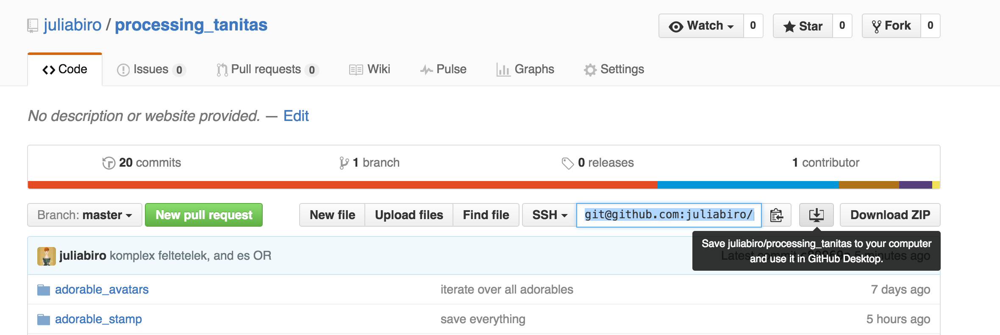

# Hogyan hasznaljam a peldakat?

A github segitsegevel könnyen le tudod tölteni a gepedre a peldakat. Az [egész repo githubos oldalán](https://github.com/juliabiro/processing_tanitas) van egy gomb fent, ami pont arra való, hogy letölthesd a példákat a gépedre. Ezt megcsiálja neked a github program, neked csak azt kell kiválasztani, hogy hova akarod lementeni. 

Ezek után csak ki kell nyitnod a processing programmal őket és tudod futtatni. 
Sőt, bele is írhatsz nyugodtan, hiszen az eredeti meglesz a githubon érintetlenül.

## nem fogom felülírni a tiedet?
Most  az én repositrymat másolod le, és nem a sajátodat. Ezért neked nincs írási jogod, vagyis nem fogod tudni felülírni azt, ami a githubon van. Lokálisan viszont el tudod menteni a változtatásokat, ha kísérletezel. 

## és hoogy kapok firssítéseket?

ha én valami őjat teszek fel a githubra, akkor te azt le tudod húzni a sync gombbal. Csak visszaírni nem tudsz. 

